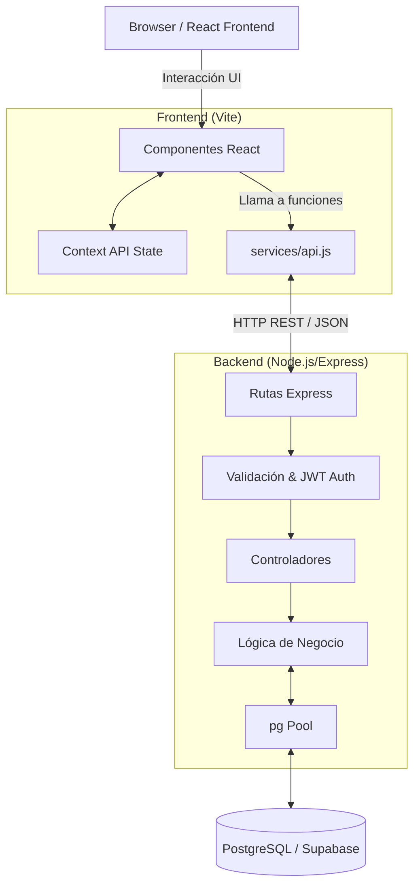

# Arquitectura del Sistema VOY

Este documento describe la arquitectura técnica de la plataforma VOY tras la transición a un modelo fullstack profesional.

## Diagrama de Arquitectura de Alto Nivel

## Stack Tecnológico

### Frontend
- **React 19**: Construcción de interfaces de usuario interactivas.
- **Vite**: Bundler ultra-rápido y servidor de desarrollo con proxy a la API.
- **React Router 7**: Manejo de rutas del lado del cliente.
- **Context API**: Manejo del estado global (`AuthContext` y `BookingContext`).
- **CSS Vanilla**: Estilos personalizados utilizando variables y diseño responsive sin dependencias externas.

### Backend
- **Node.js + Express 5**: Servidor web rápido, no bloqueante y modular.
- **PostgreSQL**: Base de datos relacional robusta.
- **node-postgres (pg)**: Cliente PostgreSQL para ejecutar queries crudos. Se eligió sobre un ORM pesado para maximizar el control y el rendimiento en queries complejos con múltiples `JOIN`s.
- **JWT (JSON Web Tokens)**: Autenticación stateless y segura.
- **Bcrypt.js**: Hashing seguro de contraseñas.
- **express-validator**: Middleware declarativo para validación de inputs del lado del servidor.

## Principios de Diseño Aplicados

1. **Separación de Responsabilidades (SoC)**: 
   El backend está claramente dividido en capas: Rutas → Controladores → Servicios. El controlador solo maneja el ciclo Request-Response de HTTP, mientras que el servicio (Service) contiene toda la lógica de negocio y las queries SQL.
2. **Atomicidad**:
   El proceso de reserva de un pasaje (`bookings.service.js`) utiliza una **Transacción SQL** con un bloqueo de lectura (`FOR UPDATE`). Esto garantiza que no se puedan vender asientos que ya no están disponibles, incluso en situaciones de alta concurrencia.
3. **Optimización de Queries**:
   En lugar de tener tablas estáticas para `Ofertas` o `Destinos Populares`, el sistema los calcula dinámicamente utilizando queries de agregación (`GROUP BY`, `MIN()`, `COUNT()`) sobre los viajes reales programados para el día de hoy, lo que evita redundancia de datos.
4. **Resiliencia Frontend**:
   El cliente web (`services/api.js`) encapsula completamente los llamados HTTP. Si en un futuro se migra a GraphQL o a gRPC, el impacto se reduce únicamente a este archivo; los componentes React no necesitan enterarse de la implementación subyacente.

## Seguridad

- **Protección de Contraseñas**: Las contraseñas nunca viajan de vuelta al cliente y se almacenan hasheadas con `bcrypt`.
- **Stateless Auth**: No se manejan sesiones en memoria en el backend. El token JWT emitido firma la identidad del usuario y es verificado en cada request protegida.
- **SQL Injection**: Todas las consultas a la base de datos utilizan queries parametrizados (`$1`, `$2`), previniendo cualquier tipo de inyección.

## Modelo de Datos (Esquema Relacional)

La base de datos consta de 6 tablas fuertemente tipadas y relacionadas:
- `users`: Clientes del sistema.
- `cities`: Catálogo de destinos/orígenes disponibles.
- `companies`: Transportistas (Flecha Bus, Andesmar, etc.).
- `trips`: El horario/viaje específico, uniendo un origen, un destino y una empresa, con sus asientos y precios.
- `bookings`: La confirmación de compra de un viaje por parte de un usuario.
- `payments`: Registro del estado financiero asociado a una reserva.

## Escalabilidad Futura (Siguientes Sprints)

La arquitectura ha sido diseñada permitiendo expansiones sencillas:
1. **Sistema de Recomendaciones con IA**: Se puede añadir un microservicio Python que lea la base de datos y exponga un endpoint `/api/recommendations`.
2. **Panel de Administrador**: Se puede agregar un rol `admin` al JWT para crear un panel web de gestión de viajes y empresas independiente.
3. **Integración de Pasarela de Pagos**: La tabla `payments` ya está preparada para conectarse vía Webhooks a Mercado Pago o Stripe.
